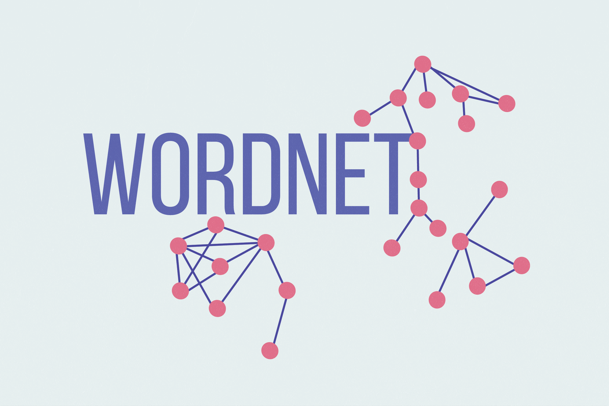

 

## COS 226 - Algorithms and Data Structures

This repository contains the Java programming assignments that I completed while taking [COS 226 at Princeton](https://www.cs.princeton.edu/courses/archive/spring24/cos226/syllabus.php) during the spring semester of my first year.

### Course Information

The course focuses on the implementation of various data structures and algorithms. It also concentrates on the time and space complexities of each of them.
Topics covered can be found [here](https://www.cs.princeton.edu/courses/archive/spring24/cos226/lectures.php).

### Java Assignments

Most of the dependencies that I used are contained within the course's algs4.jar. This can be found, along with installation instructions, [at this link](https://algs4.cs.princeton.edu/code). The same link also has any needed java programs and libraries that may not be in the .JAR file.

 <table style="width:100%">
  <tr>
    <th>Assignment</th>
    <th>Description</th>
    <th>Topics Learned</th>
  </tr>
  <tr>
    <td>
     

       <a href="/percolation"> Percolation </a>
     

     
    </td>
    <td>
      
 Estimate the percolation threshold of a composite system 

    </td>
    <td>
      
 quick-union, weighted quick-union, Monte Carlo method 

    </td>
  </tr>
  <tr>
    <td>
      

        <a href="/queues"> Queues </a>
      

      
    </td>
    <td>
      
 Create Deque and RandomizedQueue objects 

    </td>
    <td>
      
 linked lists, stacks, queues, deques, Java iterators 

    </td>
  </tr>
   <tr>
    <td>
      

        <a href="/autocomplete"> Autocomplete </a>
      

      
    </td>
    <td>
      
 Autocomplete feature for user queries 

    </td>
    <td>
      
 selection sort, insertion sort, binary search, mergesort, quicksort, Java comparators 

    </td>
  </tr>
   <tr>
    <td>
      

        <a href="kdtree"> KD Trees </a>
      

      
    </td>
    <td>
      
 Solver for any <a href="https://en.wikipedia.org/wiki/15_puzzle"> k-puzzle </a> 

    </td>
    <td>
     
 A* search, priority queues/heaps, heapsort 

    </td>
  </tr>
   <tr>
    <td>
      

        <a href="/wordnet"> WordNet </a>
      

      
    </td>
    <td>
      
 Build a <a href="https://wordnet.princeton.edu"> WordNet </a> object with built-in search methods  

    </td>
    <td>
      
 hash tables, depth-first search, breadth-first search, topological sort, minimum spanning trees, Kruskal's algorithm, Prim's algorithm 

    </td>
  </tr>
   <tr>
    <td>
      

        <a href="/seam"> Seam Carving </a>
      

      
    </td>
    <td>
      
 Content-aware image resizing API 

    </td>
    <td>
      
 Bellman-Ford algorithm, Dijkstra's algorithm, Ford-Fulkerson algorithm, MinCuts, MaxFlows 

    </td>
  </tr>
   <tr>
    <td>
      

        <a href="/fraud"> Fraud Detection </a>
      

      
    </td>
    <td>
      
 Implement a machine learning model to detect fraudulent credit card transactions 

    </td>
    <td>
      
 clustering algorithms, dimensionality reduction, weak learners, boosting algorithms, decision stumps, AdaBoost 

    </td>
  </tr>
</table>

### Licensing

Please note, this readme was shamelessly stolen and adapted from Ryan Albertson, who's own COS-226 repository can be found [here](https://github.com/RyanAlbertson/COS226_Princeton_University).
